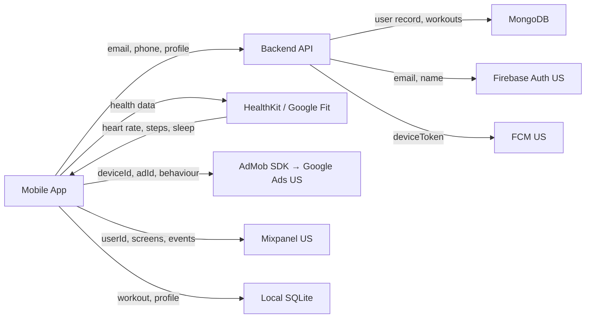

# Data Mapping — Mobile App Example

A worked example demonstrating the data-mapping skill applied to a mobile application with a backend API.

---

## Input Description

A fitness tracking mobile app (React Native) with:

- **Auth:** Email/phone registration, Firebase Auth (Google/Apple sign-in)
- **User profile:** name, email, date of birth, height, weight, fitness goals
- **Location:** GPS tracking during workouts (continuous, high-precision)
- **Health data:** Heart rate (via HealthKit/Google Fit integration), step count, calories burned, sleep data
- **Push notifications:** Firebase Cloud Messaging (FCM), device token stored server-side
- **Ads:** AdMob SDK for free tier users, passes device ID and advertising ID
- **Analytics:** Mixpanel SDK, tracks screens, user properties, workout events
- **Local storage:** SQLite for workout history, cached user profile, offline queue
- **Backend:** Node.js API, MongoDB, user data stored with userId as primary key
- **Social features:** Friend list (by email lookup), workout sharing, leaderboards

---

## Expected Output

### Data Inventory Table

| Data Element | PII Category | Source | Storage | Purpose | Legal Basis | Retention | Deletion | Shared With | Cross-Border | Confidence |
|-------------|-------------|--------|---------|---------|-------------|-----------|----------|-------------|-------------|------------|
| user.email | contact | Registration form / Firebase Auth | MongoDB users + Firebase | Account creation, friend lookup | contract | Undefined | None documented | Firebase Auth, Mixpanel | Yes (US — Firebase, Mixpanel) | HIGH |
| user.phone | contact | Registration form | MongoDB users | Account recovery, 2FA | contract | Undefined | None documented | Firebase Auth (SMS verification) | Yes (US — Firebase) | HIGH |
| user.name | contact | Registration / profile edit | MongoDB users + local SQLite | Display name, social features | contract | Undefined | None documented | None | No | HIGH |
| user.dateOfBirth | demographic | Profile setup | MongoDB users | Age-based fitness recommendations | consent | Undefined | None documented | None | No | HIGH |
| user.height | health | Profile setup | MongoDB users + local SQLite | BMI calculation, calorie estimates | consent | Undefined | None documented | None | No | HIGH |
| user.weight | health | Profile setup / weigh-in logs | MongoDB users + local SQLite | BMI calculation, progress tracking | consent | Undefined | None documented | None | No | HIGH |
| workout.gpsTrack | location | GPS during workout recording | MongoDB workouts + local SQLite | Route display, distance calculation | consent | Undefined | None documented | None | No | HIGH |
| workout.heartRate | health | HealthKit / Google Fit API | MongoDB workouts + local SQLite | Heart rate zones, calorie calculation | consent | Undefined | None documented | None | No | HIGH |
| workout.stepCount | health | HealthKit / Google Fit API | MongoDB workouts | Activity tracking | consent | Undefined | None documented | None | No | HIGH |
| sleep.data | health | HealthKit / Google Fit API | MongoDB sleep | Sleep quality tracking | consent | Undefined | None documented | None | No | HIGH |
| fcm.deviceToken | identifier | App registration with FCM | MongoDB users (deviceTokens array) | Push notifications | legitimate_interest | Undefined | None documented | Firebase Cloud Messaging | Yes (US — Google) | HIGH |
| advertisingId | identifier | AdMob SDK (automatic) | Not stored locally (SDK-managed) | Ad personalisation | consent | AdMob-controlled | N/A (SDK-managed) | AdMob, Google ad network | Yes (US — Google) | HIGH |
| deviceId | identifier | AdMob SDK (automatic) | Not stored locally (SDK-managed) | Device-level ad targeting | consent | AdMob-controlled | N/A (SDK-managed) | AdMob, Google ad network, **unknown sub-processors** | Yes (US — Google) | MEDIUM |
| mixpanel.userId | behavioural | App init | Mixpanel (US) | Product analytics | TBD | Mixpanel default | Mixpanel deletion API | Mixpanel | Yes (US) | HIGH |
| mixpanel.screenViews | behavioural | Automatic screen tracking | Mixpanel (US) | UX analytics | TBD | Mixpanel default | Mixpanel deletion API | Mixpanel | Yes (US) | HIGH |
| mixpanel.workoutEvents | behavioural | Workout completion | Mixpanel (US) | Feature usage analytics | TBD | Mixpanel default | Mixpanel deletion API | Mixpanel | Yes (US) | HIGH |
| friend.emailLookup | contact | Friend search feature | Transient (API query) | Find friends by email | consent (searcher) | Not stored (query only) | N/A | None | No | MEDIUM |
| leaderboard.displayData | identifier | Workout completion | MongoDB leaderboards | Public ranking display | consent | Undefined | None documented | None | No | MEDIUM |
| local SQLite (all) | multiple | App usage | Device SQLite | Offline access, performance | contract | No TTL | App uninstall only | None | No | MEDIUM |
| Firebase Auth profile | contact | Google/Apple sign-in | Firebase Auth (US) | Authentication, profile sync | contract | Firebase-managed | Firebase account deletion | Firebase | Yes (US) | HIGH |

### Third-Party Processor Table

| Processor | Data Received | Purpose | DPA Required | Sub-processors | Transfer Mechanism | Confidence |
|-----------|--------------|---------|-------------|----------------|-------------------|------------|
| Firebase Auth | email, phone, name, Google/Apple profile | Authentication | Yes | Google Cloud | Google standard SCCs | HIGH |
| Firebase Cloud Messaging | deviceToken, notification content | Push notifications | Yes | Google Cloud | Google standard SCCs | HIGH |
| AdMob | deviceId, advertisingId, behavioural signals | Advertising (free tier) | Yes | Google ad network, **unknown third-party ad partners** | Unknown | MEDIUM |
| Mixpanel | userId, screen views, workout events, user properties | Product analytics | Yes | AWS (hosting) | Unknown | MEDIUM |
| HealthKit / Google Fit | Heart rate, steps, sleep, calories (read access) | Health data import | N/A (on-device API) | N/A | N/A | HIGH |

### Data Flow Diagram

### Gap Analysis

No existing data inventory provided — all findings are new.

### Completeness Score

**Completeness: 75%** (15 of 20 entries classified with HIGH confidence). 5 entries are MEDIUM or LOW confidence due to: AdMob sub-processor chain unknown, Mixpanel transfer mechanism unverified, local SQLite retention depends on OS behaviour, friend email lookup data flow partially inferred, leaderboard data scope uncertain.

---

## Key Findings Demonstrated

| Finding | Why It Matters |
|---------|---------------|
| Health data (heart rate, weight, sleep) classified as special category | Under GDPR Art. 9, health data requires explicit consent and heightened protections. The app collects 5 health data fields — each needs a specific consent mechanism documented. **Recommend human review.** |
| Location data at high precision (GPS tracks) | Continuous GPS tracking during workouts collects precise geolocation. Purpose stated as "route display" but the data could reveal home address, workplace, daily routines. Purpose should be narrowed and retention minimised. |
| AdMob shares deviceId with unknown sub-processors | The AdMob SDK passes device identifiers into Google's ad network. The full chain of data recipients is not determinable from code. DPA coverage is MEDIUM confidence — Google's standard terms may not cover all ad partners. |
| Local SQLite contains PII without encryption at rest | Workout history, GPS tracks, health data, and cached profile are stored in plaintext SQLite on the device. No SQLCipher or equivalent encryption. Data persists until app uninstall — no in-app deletion mechanism. |
| No documented retention policy for any field | All MongoDB fields have "Undefined" retention. Health and location data should have the shortest defensible retention period. |
| Mixpanel analytics lacks documented consent mechanism | Analytics events tracked with userId and workout details but no consent gate visible in code. Legal basis marked "TBD." Given that workout events could reveal health-related information, this is particularly high-risk. |
