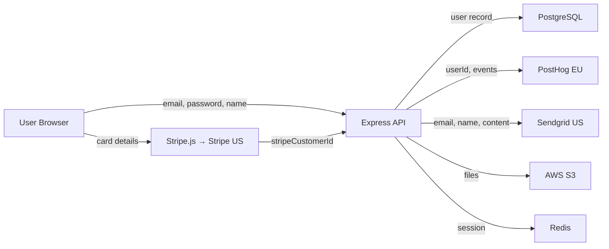

# Data Mapping — SaaS App Example

A worked example demonstrating the data-mapping skill applied to a typical SaaS application backend.

---

## Input Description

A project management SaaS application with:

- **Auth:** Email/password registration, bcrypt hashing, session-based auth
- **Database:** PostgreSQL via Prisma, tables: `users` (email, passwordHash, name, avatarUrl, role), `projects`, `tasks`, `comments`
- **Payments:** Stripe integration, `stripeCustomerId` stored in users table, card details handled by Stripe.js (never touch server)
- **Analytics:** PostHog server-side SDK, tracks events with userId and project metadata
- **Email:** Sendgrid for transactional emails (invitations, notifications, password reset)
- **Storage:** AWS S3 for file attachments (user-uploaded documents)
- **Cache:** Redis for session storage and rate limiting
- **No existing data inventory**

---

## Expected Output

### Data Inventory Table

| Data Element | PII Category | Source | Storage | Purpose | Legal Basis | Retention | Deletion | Shared With | Cross-Border | Confidence |
|-------------|-------------|--------|---------|---------|-------------|-----------|----------|-------------|-------------|------------|
| users.email | contact | POST /api/auth/register | PostgreSQL users | Account creation, login, notifications | contract | Undefined | None documented | Sendgrid (email delivery) | Yes (US — Sendgrid) | HIGH |
| users.passwordHash | authentication | POST /api/auth/register | PostgreSQL users | Authentication | contract | Undefined | None documented | None | No | HIGH |
| users.name | contact | POST /api/auth/register | PostgreSQL users | Display name in app, email personalisation | contract | Undefined | None documented | Sendgrid (email personalisation) | Yes (US — Sendgrid) | HIGH |
| users.avatarUrl | identifier | PUT /api/users/profile | PostgreSQL users + S3 | Profile display | consent | Undefined | None documented | AWS S3 (storage) | Unknown (S3 region not verified) | MEDIUM |
| users.stripeCustomerId | financial | POST /api/billing/subscribe | PostgreSQL users | Link to Stripe billing | contract | Undefined | None documented | Stripe (payment processing) | Yes (US — Stripe) | HIGH |
| users.role | identifier | POST /api/auth/register (default) | PostgreSQL users | Access control | contract | Undefined | None documented | None | No | HIGH |
| comments.body | user_content | POST /api/comments | PostgreSQL comments | User communication within projects | contract | Undefined | None documented | None | No | HIGH |
| session data | session_data | Login flow | Redis | Session management | contract | No explicit TTL found | None documented | None | Unknown (Redis host) | MEDIUM |
| PostHog events | behavioural | All API endpoints | PostHog (EU) | Product analytics | TBD | PostHog default retention | deletePostHogPerson() | PostHog | Yes (EU) | HIGH |
| password reset token | authentication | POST /api/auth/reset | PostgreSQL (transient) | Password recovery | contract | Undefined | None documented | Sendgrid (reset link in email) | Yes (US — Sendgrid) | HIGH |
| S3 file uploads | user_content | POST /api/files/upload | AWS S3 | File attachments on tasks | contract | Undefined | None documented | AWS S3 | Unknown | MEDIUM |
| IP address | identifier | Express req.ip (rate limiting) | In-memory (rate limiter) | Rate limiting, abuse prevention | legitimate_interest | Request duration only | Automatic (in-memory) | None | No | MEDIUM |
| invitation email | contact | POST /api/invitations | Transient (sent via Sendgrid) | Invite new users to projects | consent (inviter) | Not stored | N/A | Sendgrid | Yes (US — Sendgrid) | HIGH |

### Third-Party Processor Table

| Processor | Data Received | Purpose | DPA Required | Sub-processors | Transfer Mechanism | Confidence |
|-----------|--------------|---------|-------------|----------------|-------------------|------------|
| Stripe | stripeCustomerId, payment events | Payment processing | Yes | Unknown | SCCs (Stripe standard) | HIGH |
| PostHog | userId, event names, project metadata | Product analytics | Yes | AWS (hosting) | SCCs (PostHog EU) | HIGH |
| Sendgrid | email, name, email content | Transactional email delivery | Yes | Unknown | Unknown | MEDIUM |
| AWS S3 | User-uploaded files (may contain PII) | File storage | Yes | N/A | Unknown (depends on S3 region) | MEDIUM |

### Data Flow Diagram

### Gap Analysis

No existing data inventory provided — all findings are new. Recommend creating a `data_inventory.yaml` from this output.

### Completeness Score

**Completeness: 69%** (9 of 13 fields classified with HIGH confidence). 4 fields are MEDIUM confidence due to: Redis configuration not inspected (session TTL), S3 region unknown, avatarUrl handling partially inferred, IP address handling inferred from rate limiter middleware.

---

## Key Findings Demonstrated

| Finding | Why It Matters |
|---------|---------------|
| No retention policy on any database field | All PostgreSQL fields have "Undefined" retention. Without retention policies, data accumulates indefinitely — violating GDPR Art. 5(1)(e) (storage limitation). |
| No account deletion mechanism | No `DELETE /api/users` endpoint found. Users cannot exercise right to erasure (GDPR Art. 17, CCPA §1798.105). |
| 3 of 4 processors involve cross-border transfers to US | Sendgrid, Stripe, and potentially S3 transfer data outside the EU. Each requires an appropriate transfer mechanism (SCCs, adequacy). DPA status is unknown for Sendgrid and S3. |
| Redis session has no explicit TTL | Session data in Redis may persist indefinitely if no `maxAge` or `expire` is configured. MEDIUM confidence because TTL could be set in Redis config rather than application code. |
| PostHog analytics lacks documented consent mechanism | Events tracked with userId but no consent gate visible in code. Legal basis marked "TBD" — requires either consent or legitimate interest assessment. |
