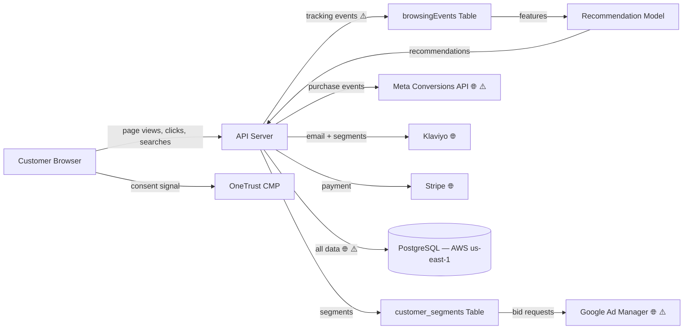

# DPIA Generator — E-commerce Cross-Border Example

A worked example demonstrating the DPIA Generator skill applied to an EU/US e-commerce platform with behavioural advertising and cross-border data transfers.

---

## Input Description

An e-commerce marketplace operating in the EU and US with:

- **Users:** 1.2M registered customers (800K EU, 400K US), plus anonymous browsing visitors
- **Behavioural advertising:** Real-time bidding (RTB) integration with Google Ad Manager; customer segments built from purchase history, browsing behaviour, and location data
- **Database:** PostgreSQL, tables: `customers` (name, email, address, phone, payment_method_id), `orders`, `browsing_events` (page_views, clicks, search_queries, timestamps), `customer_segments` (segment_labels, score, updated_at)
- **Personalisation engine:** Collaborative filtering model recommends products based on purchase history and browsing behaviour; A/B testing framework assigns users to experiment cohorts
- **Integrations:** Stripe (payments), Google Ad Manager (RTB), Meta Conversions API (purchase events), Klaviyo (email marketing with segmentation), Cloudflare (CDN + WAF, US and EU PoPs)
- **Cross-border:** EU customer data processed in US-hosted infrastructure (AWS us-east-1); Stripe and Google process data in the US
- **Cookie banner:** OneTrust CMP deployed, but server-side tracking fires before consent response is received
- **No existing DPIA**

---

## Expected Output

> **DRAFT — FOR REVIEW ONLY.** This DPIA was generated by an AI coding agent from code analysis. It is not a finalised impact assessment. A qualified Data Protection Officer or privacy professional must review, validate, and approve this document before it is relied upon for regulatory compliance. Legal basis assessments and necessity/proportionality findings require legal judgment.

## DPIA — EU/US E-commerce Marketplace

### Summary
- **Processing description:** E-commerce marketplace processing purchase, browsing, and location data for 1.2M customers to build behavioural advertising segments and personalised product recommendations, with EU-US cross-border transfers
- **DPIA required:** Yes
- **Art. 35(3) mandatory triggers:** 0 of 3
- **WP29 criteria met:** 4 of 9
- **Risk level:** HIGH
- **Risks identified:** 7 (2 HIGH, 4 MEDIUM, 1 LOW)
- **Art. 36 prior consultation recommended:** No

### Section 1: Trigger Assessment

| Trigger | Type | Status | Evidence | Confidence |
|---------|------|--------|----------|------------|
| Art. 35(3)(a) — automated evaluation with significant effects | Mandatory | NOT MET | Segmentation and recommendations influence product visibility but do not produce legal or similarly significant effects on customers | MEDIUM |
| Art. 35(3)(b) — large-scale special categories | Mandatory | NOT MET | No Art. 9 data explicitly processed — purchase data may imply sensitive information (e.g., health products) but is not categorised as such | MEDIUM |
| Art. 35(3)(c) — systematic public monitoring | Mandatory | NOT MET | Website tracking is not monitoring of a publicly accessible physical area | HIGH |
| WP29 #1 — Evaluation or scoring | Heuristic | PRESENT | `buildSegment(customerId, purchaseHistory, browsingEvents)` assigns behavioural segment labels and scores used for ad targeting | HIGH |
| WP29 #2 — Automated decision-making | Heuristic | ABSENT | Segments influence ad targeting and recommendations but do not make decisions with legal or significant effects | MEDIUM |
| WP29 #3 — Systematic monitoring | Heuristic | PRESENT | `browsingEvents` table records all page views, clicks, and search queries with timestamps — systematic tracking of user behaviour across the platform | HIGH |
| WP29 #4 — Sensitive data | Heuristic | BORDERLINE | Purchase history may reveal health conditions, religious practices, or political beliefs via product categories — but no explicit special category processing | MEDIUM |
| WP29 #5 — Large scale | Heuristic | PRESENT | 1.2M registered customers, continuous browsing event collection, EU-wide coverage | HIGH |
| WP29 #6 — Combining datasets | Heuristic | PRESENT | `enrichCustomerProfile(purchaseHistory, browsingEvents, locationData, klaviyoEngagement)` merges 4 data sources into unified advertising profiles | HIGH |
| WP29 #7 — Vulnerable data subjects | Heuristic | ABSENT | General consumer marketplace — no specific vulnerable population targeting | HIGH |
| WP29 #8 — Innovative technology | Heuristic | ABSENT | Collaborative filtering and RTB are established technologies | HIGH |
| WP29 #9 — Preventing rights exercise | Heuristic | BORDERLINE | Server-side tracking fires before consent response — users' consent choice may not be respected for initial page load events | MEDIUM |

### Section 4: Data Flow Diagram

Legend: ⚠️ = risk annotation, 🔒 = encrypted, 🌐 = cross-border transfer

### Section 5: Risk Register

| # | Risk Category | Description | Likelihood | Impact | Severity | Evidence | Confidence |
|---|--------------|-------------|------------|--------|----------|----------|------------|
| 1 | Cross-border exposure | All EU customer data (800K subjects) stored in AWS us-east-1 (US) — no documented adequacy decision or SCCs for primary database | HIGH | HIGH | CRITICAL | PostgreSQL connection string points to `us-east-1`; no transfer mechanism documentation found | HIGH |
| 2 | Lack of transparency | Server-side tracking fires before OneTrust consent response is received — browsing events recorded without valid consent | HIGH | MEDIUM | HIGH | `trackEvent()` called in middleware before `checkConsent()` response is processed | HIGH |
| 3 | Purpose creep | Browsing behaviour collected for "site functionality" repurposed for behavioural advertising segments without separate consent | MEDIUM | MEDIUM | MEDIUM | Same `browsingEvents` table feeds both recommendation model and `buildSegment()` for RTB | HIGH |
| 4 | Re-identification risk | RTB bid requests to Google Ad Manager contain customer segments and pseudonymised IDs that could enable re-identification when combined with Google's own data | MEDIUM | HIGH | HIGH | `adManager.sendBidRequest({ segments, pseudoId, pageUrl })` — Google can cross-reference with logged-in user data | MEDIUM |
| 5 | Inadequate retention controls | `browsingEvents` table has no retention policy — granular clickstream data accumulates indefinitely | MEDIUM | MEDIUM | MEDIUM | No TTL, archival, or deletion mechanism for browsing events | HIGH |
| 6 | Excessive collection | Search queries stored verbatim — may contain personal data typed by users (names, addresses, health terms) | MEDIUM | MEDIUM | MEDIUM | `browsingEvents` stores `search_query` as free text | MEDIUM |
| 7 | Insufficient data subject rights | No mechanism for customers to download their behavioural profile or segment assignments | LOW | MEDIUM | LOW | No export endpoint covers `customer_segments` or `browsingEvents` tables | HIGH |

### Section 6: Mitigation Measures

| # | Risk | Mitigation | Status | Residual Severity |
|---|------|-----------|--------|-------------------|
| 1 | Cross-border exposure | Migrate primary database to AWS eu-west-1; implement SCCs with all US processors; evaluate EU Data Privacy Framework adequacy for each processor | RECOMMENDED | MEDIUM |
| 2 | Consent timing | Defer server-side tracking until OneTrust consent callback is received; queue events and discard if consent is denied | RECOMMENDED | LOW |
| 3 | Purpose creep | Separate browsing data for functionality (anonymous) from advertising (consented, pseudonymised); implement purpose-specific consent gates | RECOMMENDED | LOW |
| 4 | Re-identification risk | Strip segment labels from RTB bid requests; use cohort-level targeting (Topics API) instead of individual-level segments | RECOMMENDED | MEDIUM |
| 5 | Inadequate retention | Define retention period for browsing events (e.g., 90 days for analytics, 30 days for advertising); implement automated purge | RECOMMENDED | LOW |
| 6 | Excessive collection | Hash or truncate search queries after 7 days; filter PII patterns (email, phone regex) from stored queries at write time | RECOMMENDED | LOW |
| 7 | Insufficient rights | Add behavioural profile export to customer data download feature; include segment labels and browsing summary | RECOMMENDED | LOW |

### Section 8: Professional Review Checklist

| # | Item | Status | Notes |
|---|------|--------|-------|
| (a) | Processing operations described (Art. 35(7)(a)) | COMPLETE | Behavioural tracking, segmentation, RTB advertising, personalised recommendations, cross-border transfers |
| (b) | Necessity & proportionality assessed (Art. 35(7)(b)) | COMPLETE | All findings LOW confidence — legal review required, particularly for legitimate interest basis for behavioural advertising |
| (c) | Risks to data subjects evaluated (Art. 35(7)(c)) | COMPLETE | 7 risks identified across 7 taxonomy categories |
| (d) | Mitigations identified (Art. 35(7)(d)) | COMPLETE | All mitigations currently RECOMMENDED — none yet implemented |
| (e) | Data subject views sought (Art. 35(9)) | NOT ADDRESSED | Consider customer survey on advertising data use expectations; review complaint history for privacy-related concerns |
| (f) | DPA trigger lists checked | INCOMPLETE | Check relevant DPA lists — behavioural advertising at this scale may appear on multiple DPA DPIA lists (e.g., CNIL's list includes "profiling for direct marketing") |
| (g) | Review date set | NOT SET | Recommend: 2026-09-21 or upon changes to advertising integrations, database migration, or new market expansion |

---

## Key Findings

| Finding | Why It Matters |
|---------|---------------|
| No Art. 35(3) mandatory trigger but 4/9 WP29 criteria met | DPIA required under WP29 heuristic. Evaluation/scoring, systematic monitoring, large scale, and combining datasets — each independently significant, together creating a clear high-risk profile. |
| EU customer data stored in US without transfer safeguards | 800K EU data subjects' personal data in AWS us-east-1 without documented SCCs or adequacy decision is a CRITICAL risk. Post-Schrems II, this is a priority compliance gap. |
| Consent timing race condition | Server-side tracking fires before OneTrust delivers the consent signal. This means browsing events are recorded without valid consent — a technical implementation gap that undermines the legal basis for tracking. |
| RTB re-identification risk | Individual-level segment data in bid requests enables cross-referencing with Google's own user profiles. This is an industry-wide concern flagged by multiple DPAs and the subject of ongoing enforcement actions. |
| Art. 36 not recommended | Residual risks can be mitigated to MEDIUM or below. The CRITICAL cross-border risk drops to MEDIUM with database migration and SCCs. If migration is not feasible, reassess Art. 36 consultation. |
