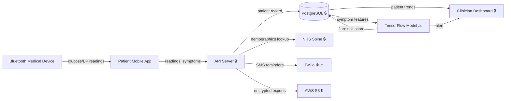

# DPIA Generator — Health App Example

A worked example demonstrating the DPIA Generator skill applied to a chronic disease management app prescribed by clinicians to patients.

---

## Input Description

A mobile health application for chronic disease management with:

- **Users:** Patients with chronic conditions (diabetes, hypertension, asthma) prescribed the app by their clinician via an NHS or private healthcare pathway
- **Health data:** Daily symptom logs, medication adherence tracking, blood glucose/blood pressure readings from Bluetooth-connected medical devices
- **Database:** PostgreSQL, tables: `patients` (name, email, nhs_number, date_of_birth, conditions), `readings` (patient_id, device_id, reading_type, value, timestamp), `medications`, `symptom_logs`
- **Clinician dashboard:** Web interface where prescribing clinicians view patient data and trends
- **ML predictions:** TensorFlow model predicts "flare risk" scores from symptom patterns, surfaced to clinicians as alerts
- **Integrations:** NHS Spine (patient demographic lookup), Twilio (SMS medication reminders), AWS S3 (encrypted reading exports)
- **Scale:** 45K active patients across England and Wales, expanding to Scotland
- **No existing DPIA**

---

## Expected Output

> **DRAFT — FOR REVIEW ONLY.** This DPIA was generated by an AI coding agent from code analysis. It is not a finalised impact assessment. A qualified Data Protection Officer or privacy professional must review, validate, and approve this document before it is relied upon for regulatory compliance. Legal basis assessments and necessity/proportionality findings require legal judgment.

## DPIA — Chronic Disease Management App

### Summary
- **Processing description:** Mobile health app processing patient health readings, symptom data, and medication adherence for chronic disease management, with ML-based flare risk prediction surfaced to prescribing clinicians
- **DPIA required:** Yes
- **Art. 35(3) mandatory triggers:** 1 of 3 (Art. 35(3)(b))
- **WP29 criteria met:** 4 of 9
- **Risk level:** HIGH
- **Risks identified:** 7 (2 HIGH, 4 MEDIUM, 1 LOW)
- **Art. 36 prior consultation recommended:** No

### Section 1: Trigger Assessment

| Trigger | Type | Status | Evidence | Confidence |
|---------|------|--------|----------|------------|
| Art. 35(3)(a) — automated evaluation with significant effects | Mandatory | NOT MET | ML model produces risk scores but clinicians make treatment decisions — no solely automated decisions with significant effects. Note: if clinicians routinely follow ML recommendations without independent assessment (rubber-stamping), this trigger may be MET. | MEDIUM |
| Art. 35(3)(b) — large-scale special categories | Mandatory | MET | Health data (Art. 9(2)(h)) processed for 45K patients: `readings` table stores blood glucose, blood pressure; `conditions` column stores diagnosis codes | HIGH |
| Art. 35(3)(c) — systematic public monitoring | Mandatory | NOT MET | App monitors patients privately, not in a publicly accessible area | HIGH |
| WP29 #1 — Evaluation or scoring | Heuristic | PRESENT | `flareRiskModel.predict(symptomFeatures)` produces numeric risk score surfaced to clinicians | HIGH |
| WP29 #2 — Automated decision-making | Heuristic | ABSENT | ML scores are advisory — clinicians make decisions. No automated treatment changes | HIGH |
| WP29 #3 — Systematic monitoring | Heuristic | BORDERLINE | Continuous health readings from connected devices constitute systematic observation of patients | MEDIUM |
| WP29 #4 — Sensitive data | Heuristic | PRESENT | Health data (Art. 9), NHS numbers, medical conditions, medication records | HIGH |
| WP29 #5 — Large scale | Heuristic | PRESENT | 45K active patients across England and Wales, continuous daily readings | HIGH |
| WP29 #6 — Combining datasets | Heuristic | ABSENT | Data sources are within the same processing operation — no cross-purpose combination | HIGH |
| WP29 #7 — Vulnerable data subjects | Heuristic | PRESENT | Patients in a care relationship with prescribing clinicians — asymmetric power dynamic; chronic disease patients have heightened dependency on the service | HIGH |
| WP29 #8 — Innovative technology | Heuristic | PRESENT | TensorFlow ML model for health prediction from IoT device readings — novel combination of health AI and connected medical devices | HIGH |
| WP29 #9 — Preventing rights exercise | Heuristic | ABSENT | No evidence of consent walls or service restrictions conditional on data sharing | HIGH |

### Section 4: Data Flow Diagram

Legend: ⚠️ = risk annotation, 🔒 = encrypted, 🌐 = cross-border transfer

### Section 5: Risk Register

| # | Risk Category | Description | Likelihood | Impact | Severity | Evidence | Confidence |
|---|--------------|-------------|------------|--------|----------|----------|------------|
| 1 | Unauthorised access or disclosure | Health data breach exposing diagnosis codes, readings, and NHS numbers for 45K patients | MEDIUM | HIGH | HIGH | `patients` table contains `nhs_number`, `conditions`; `readings` table has health measurements — high-value target | HIGH |
| 2 | Cross-border exposure | Twilio (US-headquartered) receives patient phone numbers for SMS reminders — health context inferable from timing | MEDIUM | MEDIUM | MEDIUM | `twilio.messages.create({ to: patient.phone, body: medicationReminder })` | HIGH |
| 3 | Automated decision-making risk | ML flare risk scores may influence clinical decisions — model bias could disproportionately affect certain patient populations | MEDIUM | HIGH | HIGH | `flareRiskModel.predict()` scores surfaced as alerts to clinicians; no model fairness or bias auditing visible | MEDIUM |
| 4 | Inadequate retention controls | No retention policy defined for health readings — data accumulates indefinitely | MEDIUM | MEDIUM | MEDIUM | `readings` table has no TTL, no archival mechanism, no deletion scheduled task | HIGH |
| 5 | Insufficient data subject rights | No patient data export endpoint; no mechanism for patients to access or download their health readings | MEDIUM | MEDIUM | MEDIUM | No `GET /api/patients/export` or equivalent found | HIGH |
| 6 | Lack of transparency | Patients not informed about ML processing of their health data or how flare risk scores are calculated | MEDIUM | MEDIUM | MEDIUM | No disclosure, consent flow, or explanation mechanism for ML predictions | MEDIUM |
| 7 | Excessive collection | Bluetooth device metadata (device_id, firmware version, MAC address) stored alongside health readings without clear clinical purpose | LOW | LOW | LOW | `readings` table includes `device_id` column; `devices` table stores hardware metadata | MEDIUM |

### Section 6: Mitigation Measures

| # | Risk | Mitigation | Status | Residual Severity |
|---|------|-----------|--------|-------------------|
| 1 | Unauthorised access | Database encryption at rest (AES-256), TLS in transit, role-based access control for clinician dashboard | PARTIALLY_IMPLEMENTED | MEDIUM |
| 2 | Cross-border exposure | Evaluate Twilio EU-hosted messaging; negotiate DPA with SCCs; minimise data in SMS content | RECOMMENDED | LOW |
| 3 | ML bias risk | Implement model fairness audit across demographic groups; add clinician override logging; document model limitations | RECOMMENDED | MEDIUM |
| 4 | Inadequate retention | Define clinically appropriate retention period (e.g., 10 years per NHS records management code); implement automated archival | RECOMMENDED | LOW |
| 5 | Insufficient rights | Implement patient data export in structured format (FHIR-compatible); add to patient-facing settings | RECOMMENDED | LOW |
| 6 | Lack of transparency | Add in-app disclosure about ML processing; provide plain-language explanation of flare risk methodology | RECOMMENDED | LOW |
| 7 | Excessive collection | Remove non-clinical device metadata from `readings` table; store only device_type for troubleshooting | RECOMMENDED | LOW |

### Section 8: Professional Review Checklist

| # | Item | Status | Notes |
|---|------|--------|-------|
| (a) | Processing operations described (Art. 35(7)(a)) | COMPLETE | Health data collection, ML prediction, clinician dashboard, SMS reminders, NHS Spine integration |
| (b) | Necessity & proportionality assessed (Art. 35(7)(b)) | COMPLETE | All findings LOW confidence — legal review required, particularly for Art. 9(2)(h) health processing basis |
| (c) | Risks to data subjects evaluated (Art. 35(7)(c)) | COMPLETE | 7 risks identified across 7 taxonomy categories |
| (d) | Mitigations identified (Art. 35(7)(d)) | COMPLETE | 1 partially implemented (encryption), 6 recommended |
| (e) | Data subject views sought (Art. 35(9)) | NOT ADDRESSED | Patient consultation particularly important given vulnerable subjects — consider patient advisory group or survey of existing users |
| (f) | DPA trigger lists checked | INCOMPLETE | Check ICO list — health data processing at this scale is likely on the ICO's mandatory DPIA list |
| (g) | Review date set | NOT SET | Recommend: 2026-09-21 or upon Scotland expansion, model retraining, or new device integrations |

---

## Key Findings

| Finding | Why It Matters |
|---------|---------------|
| Art. 35(3)(b) mandatory trigger met independently | Large-scale processing of health data (Art. 9) for 45K patients is a mandatory DPIA trigger regardless of WP29 criteria. |
| 4/9 WP29 criteria PRESENT (sensitive data, large scale, vulnerable subjects, innovative tech) with 1 BORDERLINE (systematic monitoring) | The trigger assessment shows 4 firmly PRESENT + 1 BORDERLINE (#3 systematic monitoring). Count as 4 unless treating BORDERLINE as PRESENT per the conservative default. The combination of health data, vulnerable patients, and ML predictions creates compounding risk. |
| Patients are vulnerable data subjects | Patients in a clinical care relationship have limited ability to refuse the app if prescribed by their clinician. This asymmetric power dynamic amplifies the impact of all other risks. |
| ML model lacks fairness auditing | Flare risk predictions influence clinical attention. Without bias auditing, the model may systematically under-serve certain patient demographics — a harm amplified by the healthcare context. |
| Art. 36 not recommended | Residual risks can be mitigated to MEDIUM or below through recommended measures. If encryption, retention, and transparency mitigations are not implemented, reassess Art. 36 consultation. |
