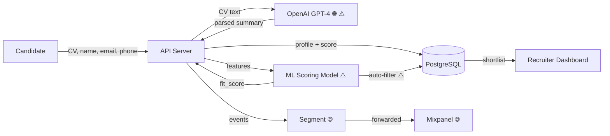

# DPIA Generator — SaaS Profiling Example

A worked example demonstrating the DPIA Generator skill applied to a SaaS platform with ML-based user profiling and automated decision-making.

---

## Input Description

A B2B SaaS platform for recruitment agencies with:

- **User profiling:** ML model scores candidates on "job fit" using CV data, work history, and behavioural signals (platform activity, response times)
- **Automated decisions:** Candidates below a score threshold are automatically filtered out of shortlists — no human review of filtered candidates
- **Database:** PostgreSQL via Prisma, tables: `candidates` (name, email, phone, cv_text, fit_score, filtered_at), `assessments`, `activity_logs`
- **Scale:** 200K+ candidate profiles, processing across 15 EU countries
- **Analytics:** Segment SDK tracking candidate interactions, integrated with Mixpanel
- **LLM integration:** OpenAI GPT-4 used to parse and summarise CVs before scoring
- **No existing DPIA or data inventory**

---

## Expected Output

> **DRAFT — FOR REVIEW ONLY.** This DPIA was generated by an AI coding agent from code analysis. It is not a finalised impact assessment. A qualified Data Protection Officer or privacy professional must review, validate, and approve this document before it is relied upon for regulatory compliance. Legal basis assessments and necessity/proportionality findings require legal judgment.

## DPIA — SaaS Recruitment Profiling Platform

### Summary
- **Processing description:** ML-based candidate profiling and automated shortlist filtering for recruitment agencies, processing CV data and behavioural signals across 15 EU countries
- **DPIA required:** Yes
- **Art. 35(3) mandatory triggers:** 1 of 3 (Art. 35(3)(a))
- **WP29 criteria met:** 4 of 9
- **Risk level:** HIGH
- **Risks identified:** 6 (2 HIGH, 3 MEDIUM, 1 LOW)
- **Art. 36 prior consultation recommended:** Yes

### Section 1: Trigger Assessment

| Trigger | Type | Status | Evidence | Confidence |
|---------|------|--------|----------|------------|
| Art. 35(3)(a) — automated evaluation with significant effects | Mandatory | MET | `calculateFitScore(candidate)` feeds `autoFilter()` which removes candidates from shortlists without human review — employment-significant effect | HIGH |
| Art. 35(3)(b) — large-scale special categories | Mandatory | NOT MET | No Art. 9 data explicitly collected, though CV free text may contain health/ethnicity references | MEDIUM |
| Art. 35(3)(c) — systematic public monitoring | Mandatory | NOT MET | Platform is not publicly accessible | HIGH |
| WP29 #1 — Evaluation or scoring | Heuristic | PRESENT | `fitScoreModel.predict(features)` produces numeric score used for ranking and filtering | HIGH |
| WP29 #2 — Automated decision-making | Heuristic | PRESENT | `if (fitScore < threshold) { markFiltered(candidateId) }` — no human-in-the-loop for filtered candidates | HIGH |
| WP29 #3 — Systematic monitoring | Heuristic | ABSENT | Activity logging exists but is not systematic behavioural monitoring | MEDIUM |
| WP29 #4 — Sensitive data | Heuristic | BORDERLINE | CV free text may contain special category data; no explicit parsing but no filtering either | MEDIUM |
| WP29 #5 — Large scale | Heuristic | PRESENT | 200K+ candidate profiles, 15 EU countries, Kafka event stream processing | HIGH |
| WP29 #6 — Combining datasets | Heuristic | PRESENT | `enrichProfile(cvData, activityLog, segmentEvents)` merges three data sources into scoring features | HIGH |
| WP29 #7 — Vulnerable data subjects | Heuristic | ABSENT | Job candidates are not in a formal dependency relationship with the platform | MEDIUM |
| WP29 #8 — Innovative technology | Heuristic | PRESENT | OpenAI GPT-4 for CV parsing — LLM processing of personal data is novel with uncharacterised privacy impact | HIGH |
| WP29 #9 — Preventing rights exercise | Heuristic | ABSENT | No consent walls or service restrictions found | HIGH |

### Section 4: Data Flow Diagram

Legend: ⚠️ = risk annotation, 🌐 = cross-border transfer

### Section 5: Risk Register

| # | Risk Category | Description | Likelihood | Impact | Severity | Evidence | Confidence |
|---|--------------|-------------|------------|--------|----------|----------|------------|
| 1 | Automated decision-making risk | Candidates automatically filtered without human review — employment-significant impact | HIGH | HIGH | CRITICAL | `autoFilter()` removes candidates where `fitScore < threshold`, no review pathway | HIGH |
| 2 | Cross-border exposure | CV personal data sent to OpenAI (US) without documented transfer mechanism | HIGH | MEDIUM | HIGH | `openai.chat.completions.create({ messages: [{ content: cvText }] })` | HIGH |
| 3 | Purpose creep | Behavioural activity data (response times, login frequency) combined with CV data for scoring — beyond candidate expectations | MEDIUM | MEDIUM | MEDIUM | `enrichProfile()` merges `activityLog` into scoring features | MEDIUM |
| 4 | Re-identification risk | Segment/Mixpanel receive candidate interaction events linkable to identifiable profiles | MEDIUM | MEDIUM | MEDIUM | `analytics.track('candidate_viewed', { candidateId, fitScore })` | HIGH |
| 5 | Lack of transparency | Candidates not informed their CV is processed by an external LLM or that automated filtering occurs | MEDIUM | HIGH | HIGH | No disclosure mechanism or consent flow found for LLM processing or automated filtering | HIGH |
| 6 | Excessive collection | Activity logs (response times, session duration) collected without clear necessity for recruitment purpose | MEDIUM | LOW | LOW | `activityLogs` table records granular interaction data | MEDIUM |

### Section 6: Mitigation Measures

| # | Risk | Mitigation | Status | Residual Severity |
|---|------|-----------|--------|-------------------|
| 1 | Automated decision-making | Implement mandatory human review for all filtered candidates; add explanation endpoint per Art. 22(3) | RECOMMENDED | MEDIUM |
| 2 | Cross-border exposure | Negotiate DPA with OpenAI including SCCs; evaluate EU-hosted LLM alternatives | RECOMMENDED | MEDIUM |
| 3 | Purpose creep | Remove behavioural signals from scoring model; or obtain explicit consent for this secondary purpose | RECOMMENDED | LOW |
| 4 | Re-identification risk | Pseudonymise candidate IDs before sending to analytics; strip `fitScore` from tracked events | RECOMMENDED | LOW |
| 5 | Lack of transparency | Add disclosure at CV upload explaining LLM processing and automated filtering; implement opt-out | RECOMMENDED | LOW |
| 6 | Excessive collection | Define minimum data set required for scoring; delete activity logs not used in scoring after 30 days | RECOMMENDED | LOW |

### Section 8: Professional Review Checklist

| # | Item | Status | Notes |
|---|------|--------|-------|
| (a) | Processing operations described (Art. 35(7)(a)) | COMPLETE | CV processing, ML scoring, automated filtering, analytics |
| (b) | Necessity & proportionality assessed (Art. 35(7)(b)) | COMPLETE | All findings LOW confidence — legal review required for scoring necessity and activity data proportionality |
| (c) | Risks to data subjects evaluated (Art. 35(7)(c)) | COMPLETE | 6 risks identified across 6 taxonomy categories |
| (d) | Mitigations identified (Art. 35(7)(d)) | COMPLETE | All mitigations currently RECOMMENDED — none yet implemented |
| (e) | Data subject views sought (Art. 35(9)) | NOT ADDRESSED | Candidate consultation required — consider surveying a sample of candidates about automated filtering expectations |
| (f) | DPA trigger lists checked | INCOMPLETE | Check ICO and relevant DPA lists for recruitment-specific triggers |
| (g) | Review date set | NOT SET | Recommend: 2026-09-21 or upon changes to scoring model or data sources |

---

## Key Findings

| Finding | Why It Matters |
|---------|---------------|
| Art. 35(3)(a) mandatory trigger met | Automated filtering of job candidates produces employment-significant effects — this is a textbook DPIA trigger regardless of WP29 criteria count |
| 4/9 WP29 criteria met (evaluation, automated decisions, large scale, innovative tech) | Well above the 2-criteria threshold. The combination of ML profiling with LLM processing at scale across 15 countries creates compounding privacy risks. |
| CV data sent to OpenAI without transfer safeguards | Personal data (potentially including special categories embedded in CV free text) crosses to a US processor without documented SCCs or adequacy decision |
| No human review for filtered candidates | Art. 22(1) gives data subjects the right not to be subject to solely automated decisions with significant effects. The current architecture provides no human-in-the-loop for rejected candidates. |
| Art. 36 prior consultation recommended | Two risks retain HIGH residual severity (automated decisions, transparency). If these cannot be mitigated to MEDIUM or below, prior consultation with the supervisory authority is appropriate. |
