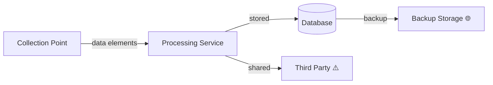

# DPIA Report Template

Blank template for the DPIA Generator skill's output. This defines the output structure — the skill populates each section during assessment. Inline comments provide guidance for each section.

---

> **DRAFT — FOR REVIEW ONLY.** This DPIA was generated by an AI coding agent from code analysis. It is not a finalised impact assessment. A qualified Data Protection Officer or privacy professional must review, validate, and approve this document before it is relied upon for regulatory compliance. Legal basis assessments and necessity/proportionality findings require legal judgment.

## DPIA — [Project/Feature Name]

### Summary

<!-- Populate all fields. Use counts from the assessment. Risk level derived from highest severity in the Risk Register. -->

- **Processing description:** [1-2 sentence summary of what the system does with personal data]
- **DPIA required:** [Yes / No / Recommended]
- **Art. 35(3) mandatory triggers:** [count] of 3
- **WP29 criteria met:** [count] of 9
- **Risk level:** [LOW | MEDIUM | HIGH | CRITICAL]
- **Risks identified:** [count] ([count] HIGH, [count] MEDIUM, [count] LOW)
- **Art. 36 prior consultation recommended:** [Yes / No]

---

### Section 1: Trigger Assessment

<!-- Assess all 3 mandatory triggers and all 9 WP29 criteria. Each mandatory trigger is independently sufficient.
     For WP29 criteria, 2+ PRESENT = recommend DPIA. BORDERLINE defaults to PRESENT with MEDIUM confidence.
     Reference checklists/wp29-dpia-criteria.md for code patterns and definitions. -->

| Trigger | Type | Status | Evidence | Confidence |
|---------|------|--------|----------|------------|
| Art. 35(3)(a) — automated evaluation with significant effects | Mandatory | [MET/NOT MET] | [specific code reference or pattern] | [HIGH/MEDIUM/LOW] |
| Art. 35(3)(b) — large-scale special categories | Mandatory | [MET/NOT MET] | [specific code reference or pattern] | [HIGH/MEDIUM/LOW] |
| Art. 35(3)(c) — systematic public monitoring | Mandatory | [MET/NOT MET] | [specific code reference or pattern] | [HIGH/MEDIUM/LOW] |
| WP29 #1 — Evaluation or scoring | Heuristic | [PRESENT/ABSENT/BORDERLINE] | [specific code reference or pattern] | [HIGH/MEDIUM/LOW] |
| WP29 #2 — Automated decision-making | Heuristic | [PRESENT/ABSENT/BORDERLINE] | [specific code reference or pattern] | [HIGH/MEDIUM/LOW] |
| WP29 #3 — Systematic monitoring | Heuristic | [PRESENT/ABSENT/BORDERLINE] | [specific code reference or pattern] | [HIGH/MEDIUM/LOW] |
| WP29 #4 — Sensitive data | Heuristic | [PRESENT/ABSENT/BORDERLINE] | [specific code reference or pattern] | [HIGH/MEDIUM/LOW] |
| WP29 #5 — Large scale | Heuristic | [PRESENT/ABSENT/BORDERLINE] | [specific code reference or pattern] | [HIGH/MEDIUM/LOW] |
| WP29 #6 — Combining datasets | Heuristic | [PRESENT/ABSENT/BORDERLINE] | [specific code reference or pattern] | [HIGH/MEDIUM/LOW] |
| WP29 #7 — Vulnerable data subjects | Heuristic | [PRESENT/ABSENT/BORDERLINE] | [specific code reference or pattern] | [HIGH/MEDIUM/LOW] |
| WP29 #8 — Innovative technology | Heuristic | [PRESENT/ABSENT/BORDERLINE] | [specific code reference or pattern] | [HIGH/MEDIUM/LOW] |
| WP29 #9 — Preventing rights exercise | Heuristic | [PRESENT/ABSENT/BORDERLINE] | [specific code reference or pattern] | [HIGH/MEDIUM/LOW] |

---

### Section 2: Processing Activities

<!-- Describe per Art. 35(7)(a). Cover nature, scope, context, and purposes.
     Nature: what operations are performed on personal data.
     Scope: volume, variety, data subjects, geographic area, duration.
     Context: controller-subject relationship, reasonable expectations, technology maturity.
     Purposes: specific, explicit, legitimate purpose for each operation. -->

**Nature:** [description of processing operations]

**Scope:** [volume, variety, geographic reach, duration]

**Context:** [relationship with data subjects, their reasonable expectations]

**Purposes:** [list of specific purposes for processing]

---

### Section 3: Necessity & Proportionality

<!-- Assess per Art. 35(7)(b). ALL findings in this section are LOW confidence by default —
     necessity and proportionality require legal judgment that cannot be determined from code alone.
     A legal professional must validate these findings. -->

| Processing Operation | Necessary? | Proportionate? | Legal Basis | Data Minimisation | Confidence |
|---------------------|-----------|---------------|-------------|-------------------|------------|
| [operation] | [Yes/No/Unclear] | [Yes/No/Unclear] | [basis or TBD] | [measures in place or None] | LOW |

---

### Section 4: Data Flow Diagram

<!-- Produce a Mermaid diagram showing data movement through the system.
     Annotate risk points with warning markers. Include a legend.
     Show: collection points, internal processing, storage, external recipients, cross-border transfers. -->

Legend: ⚠️ = risk annotation, 🔒 = encrypted, 🌐 = cross-border transfer

---

### Section 5: Risk Register

<!-- One row per identified risk. Use the 9-category risk taxonomy.
     Derive severity from the scoring rubric: likelihood × impact.
     Provide specific code evidence for each risk. -->

| # | Risk Category | Description | Likelihood | Impact | Severity | Evidence | Confidence |
|---|--------------|-------------|------------|--------|----------|----------|------------|
| 1 | [category] | [description] | [LOW/MEDIUM/HIGH] | [LOW/MEDIUM/HIGH] | [LOW/MEDIUM/HIGH/CRITICAL] | [code reference] | [HIGH/MEDIUM/LOW] |

#### Risk Scoring Rubric

| | Impact: LOW | Impact: MEDIUM | Impact: HIGH |
|---|---|---|---|
| **Likelihood: LOW** | LOW | LOW | MEDIUM |
| **Likelihood: MEDIUM** | LOW | MEDIUM | HIGH |
| **Likelihood: HIGH** | MEDIUM | HIGH | CRITICAL |

#### 9-Category Risk Taxonomy

| # | Category | Description |
|---|----------|-------------|
| 1 | Unauthorised access or disclosure | Risk of data breach, unauthorised viewing, or unintended exposure |
| 2 | Excessive collection | Collecting more data than necessary for the stated purpose |
| 3 | Purpose creep | Data used for purposes beyond what was originally specified or consented to |
| 4 | Inadequate retention controls | Data retained longer than necessary with no defined deletion mechanism |
| 5 | Insufficient data subject rights | Missing or incomplete mechanisms for access, rectification, erasure, portability, or objection |
| 6 | Cross-border exposure | Transfers to jurisdictions without adequate protection or appropriate safeguards |
| 7 | Lack of transparency | Processing not adequately disclosed to data subjects |
| 8 | Re-identification risk | Pseudonymised or anonymised data that can be re-linked to individuals |
| 9 | Automated decision-making risk | Decisions with legal or significant effects made without meaningful human oversight |

---

### Section 6: Mitigation Measures

<!-- One row per risk. Map to Risk Register by number.
     Status: IMPLEMENTED (code evidence exists), PARTIALLY_IMPLEMENTED (partial code evidence),
     or RECOMMENDED (no code evidence — this is a recommendation).
     Residual severity: severity remaining after mitigation is applied. -->

| # | Risk | Mitigation | Status | Residual Severity |
|---|------|-----------|--------|-------------------|
| 1 | [risk from register] | [mitigation description] | [IMPLEMENTED/PARTIALLY_IMPLEMENTED/RECOMMENDED] | [LOW/MEDIUM/HIGH/CRITICAL] |

---

### Section 7: Residual Risk Summary

<!-- Summarise the overall residual risk position after mitigations.
     If any risk retains HIGH or CRITICAL residual severity, recommend Art. 36 prior consultation.
     Frame Art. 36 as a recommendation, not a severity finding. -->

[Summary paragraph describing residual risk level and any remaining concerns]

**Art. 36 prior consultation recommendation:** [Yes — residual HIGH risks remain / No — residual risks are adequately mitigated]

---

### Section 8: Professional Review Checklist

<!-- All items must be addressed. Items (e) and (g) always require human action —
     the skill cannot fulfil Art. 35(9) data subject consultation or set a binding review date. -->

| # | Item | Status | Notes |
|---|------|--------|-------|
| (a) | Processing operations described (Art. 35(7)(a)) | [COMPLETE/INCOMPLETE] | [notes] |
| (b) | Necessity & proportionality assessed (Art. 35(7)(b)) | [COMPLETE/INCOMPLETE] | [notes — always flag LOW confidence] |
| (c) | Risks to data subjects evaluated (Art. 35(7)(c)) | [COMPLETE/INCOMPLETE] | [notes] |
| (d) | Mitigations identified (Art. 35(7)(d)) | [COMPLETE/INCOMPLETE] | [notes] |
| (e) | Data subject views sought (Art. 35(9)) | [NOT ADDRESSED] | AI-generated — requires human action. Document whether views were sought or justification for not seeking them. |
| (f) | DPA trigger lists checked | [COMPLETE/INCOMPLETE] | [specify which DPA lists were checked] |
| (g) | Review date set | [NOT SET] | Recommend: [date or "annually"] or upon material change to processing |

---

### Confidence Levels

| Level | Definition | Action |
|-------|-----------|--------|
| **HIGH** | Clear regulatory guidance or unambiguous code pattern | Finding can be acted on directly |
| **MEDIUM** | Reasonable interpretation, some judgment applied | Review recommended before acting |
| **LOW** | Ambiguous situation, multiple valid interpretations, or requires legal judgment | Consult a privacy professional before acting |
