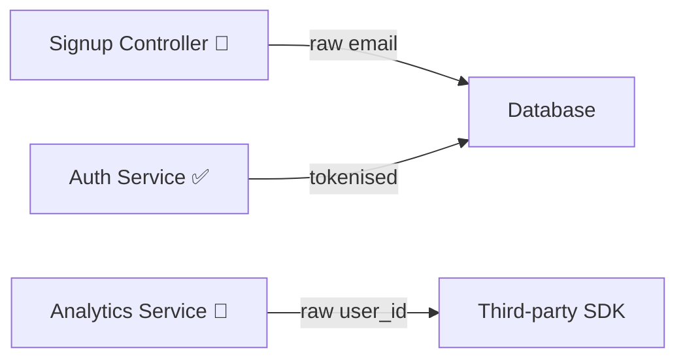

# Cavoukian's 7 Principles — Detailed Review Checklist

Reference checklist for the PbD Code Review skill. For each principle: review questions to apply, the artifact to produce, and confidence guidance.

---

## Principle 1 — Proactive not Reactive; Preventative not Remedial

> Anticipate and prevent privacy-invasive events before they happen.

### Review Questions

- Does the code introduce new PII or sensitive data fields? Is each field's collection explicitly justified with a documented purpose?
- Are there data collection points that lack corresponding privacy impact notes or annotations?
- Does the code create new pathways for data to leave the system (APIs, exports, logs, third-party calls) without prior review?
- Are there defensive measures in place (input validation, schema constraints) that prevent over-collection?

### Artifact: PII Touchpoint Manifest

```
| Field | Location | Purpose / Justification | Justified? | Risk | Confidence |
|-------|----------|-------------------------|------------|------|------------|
| email | users table, /signup endpoint | Account creation & auth | Yes | LOW | HIGH |
| phone_number | users table, /profile endpoint | None documented | NO | HIGH | HIGH |
```

Flag any field where `Justified = NO` as a blocking finding.

**Confidence guidance:** Findings about missing justification are typically HIGH confidence (the field either has a documented purpose or it doesn't). Findings about over-collection risk are MEDIUM (requires judgment about necessity).

---

## Principle 2 — Privacy as the Default Setting

> Personal data is automatically protected. No action required by the individual.

### Review Questions

- Are privacy-protective options the **default**? (analytics opt-in not opt-out, location tracking off, data sharing disabled)
- Are permissions and scopes requested at the **narrowest level** necessary?
- Are new feature flags, configs, or environment variables defaulting to the most private setting?
- Is data shared with third parties unless the user explicitly acts to prevent it?

### Artifact: Default Configuration Audit

```
| Setting | Current Default | Privacy-Safe Default | Status | Confidence |
|---------|-----------------|----------------------|--------|------------|
| analytics_enabled | true | false | FAIL | HIGH |
| location_tracking | off | off | PASS | HIGH |
| data_sharing_partners | enabled | disabled | FAIL | HIGH |
```

For every `FAIL`, produce a concrete code suggestion that flips the default to the privacy-safe value.

**Confidence guidance:** Default configuration findings are typically HIGH confidence (the value is either privacy-safe or it isn't). Determining the "privacy-safe default" for ambiguous settings may be MEDIUM.

---

## Principle 3 — Privacy Embedded into Design

> Privacy is integral to the system architecture, not bolted on after the fact.

### Review Questions

- Is PII handled in a dedicated module, service, or abstraction layer — or is it scattered across the codebase?
- Are architectural privacy patterns applied consistently? (encryption at rest, field-level tokenisation, pseudonymisation, data access layers)
- Are there direct database queries touching PII outside of a sanctioned data access layer?
- Does the code separate PII storage from analytics/operational data?

### Artifact: PII Data Flow Heatmap

Produce a description or Mermaid diagram showing which modules, services, and layers touch PII:

- Modules that handle PII **with** appropriate abstractions (✅)
- Modules that handle PII **without** abstractions or wrappers (🔴)
- Suggested refactors to centralise PII handling



**Confidence guidance:** Identifying scattered PII handling is HIGH confidence (code either uses an abstraction or it doesn't). Architectural recommendations are MEDIUM (require judgment about appropriate patterns for the project's scale).

---

## Principle 4 — Full Functionality — Positive-Sum, not Zero-Sum

> Privacy and functionality are not trade-offs. Accommodate both.

### Review Questions

- Does the privacy implementation **degrade** core user functionality?
- Are there false dichotomies? ("disable analytics entirely" vs. "track everything" with no middle ground)
- Could a privacy-preserving alternative achieve the same business goal? (differential privacy, on-device processing, k-anonymity, aggregation, federated learning)
- Are there comments or TODOs indicating privacy was deprioritised for a feature?

### Artifact: Privacy-Preserving Alternatives Table

```
| Current Approach | Privacy Risk | Alternative | Functionality Preserved? | Confidence |
|-----------------|-------------|-------------|--------------------------|------------|
| Raw event logging with user_id | HIGH | Aggregate events with k-anonymity (k≥5) | Yes | MEDIUM |
| Server-side location processing | MEDIUM | On-device geofencing with region-only reporting | Yes | MEDIUM |
| Full name stored for personalisation | LOW | First name only with pseudonymised ID | Yes | HIGH |
```

**Confidence guidance:** Identifying the privacy risk of the current approach is typically HIGH. Assessing whether an alternative preserves full functionality is MEDIUM (depends on business requirements not visible in code). Novel alternatives may be LOW.

---

## Principle 5 — End-to-End Security — Full Lifecycle Protection

> Strong security measures from collection to deletion.

### Review Questions

- Is there a defined **retention policy** and **deletion mechanism** for every PII field?
- Is data **encrypted in transit** (TLS) and **at rest** (AES-256 or equivalent)?
- Are logs, error reports, and monitoring outputs **scrubbed** of PII?
- Are database backups and caches covered by the same lifecycle policies?
- Is there a secure deletion path (not just soft-delete) when data is no longer needed?
- Are secrets, keys, and tokens stored securely (not hardcoded, not in logs)?

### Artifact: Data Lifecycle Table

```
| Field | Encrypted at Rest | Encrypted in Transit | Retention Policy | Deletion Mechanism | Log Scrubbed | Status | Confidence |
|-------|-------------------|----------------------|------------------|--------------------|--------------|--------|------------|
| email | AES-256 | TLS 1.3 | 2yr post-closure | Hard delete + backup purge | Yes | PASS | HIGH |
| phone_number | None | TLS 1.3 | Undefined | None | No | FAIL | HIGH |
```

Flag any field with `Status = FAIL` as a blocking finding.

**Confidence guidance:** Missing encryption is HIGH confidence. Encryption type/strength assessment is HIGH. Retention policy findings are HIGH (policy exists or doesn't). Whether a retention period is appropriate is LOW (requires business context and legal judgment).

---

## Principle 6 — Visibility and Transparency — Keep it Open

> Operations are verifiable and auditable.

### Review Questions

- Is there a **machine-readable data inventory** (e.g., `data_inventory.yaml`) that reflects current collection practices?
- Can a user request an export of their data and understand what is collected?
- Are **third-party SDKs and dependencies** audited for their own data collection behaviour?
- Are internal data flows documented and available for audit?
- Does the privacy policy or in-app disclosure reflect the actual code behaviour?

### Artifact: Transparency Audit

**Part 1 — Data Inventory Diff:** Fields/flows present in code but missing from documentation.

**Part 2 — Dependency Privacy Audit:**

```
| Dependency | Version | Known Data Collection | Documented in Privacy Policy? | Status | Confidence |
|-----------|---------|----------------------|-------------------------------|--------|------------|
| Segment | 4.2.1 | User events, device info, IP | No | FAIL | HIGH |
| Sentry | 7.0.0 | Error context (can include PII) | Yes | WARN | MEDIUM |
```

**Confidence guidance:** Whether a dependency is documented in the privacy policy is HIGH confidence. What data a dependency actually collects may be MEDIUM (depends on SDK version, configuration, and runtime behaviour not visible in code).

---

## Principle 7 — Respect for User Privacy — Keep it User-Centric

> Keep the interests of the individual uppermost.

### Review Questions

- Does the UI make privacy choices **clear, accessible, and non-deceptive**? (no dark patterns)
- Is consent **granular** (per-purpose, not bundled) and **revocable**?
- Can users **delete their data** completely? Does "delete my account" actually purge all data stores?
- Are privacy settings **easy to find**, not buried in sub-menus?
- Is the language in consent flows plain and understandable?

### Artifact: User Privacy Controls Checklist

```
| Control | Implemented? | Granular? | Revocable? | Accessible? | Notes | Confidence |
|---------|-------------|-----------|------------|-------------|-------|------------|
| Cookie consent | Yes | Yes — per category | Yes | Homepage banner | OK | HIGH |
| Data export | Yes | N/A | N/A | Settings > Privacy | OK | HIGH |
| Account deletion | Partial | N/A | N/A | Settings > Account | Doesn't purge analytics | HIGH |
| Marketing opt-out | No | — | — | — | MISSING | HIGH |
```

### Artifact: Delete-My-Account Trace

Simulate a full account deletion and list every data store and whether it is purged:

```
| Data Store | Field(s) | Purged on Deletion? | Method | Status | Confidence |
|-----------|----------|---------------------|--------|--------|------------|
| users table | all PII | Yes | Hard delete | PASS | HIGH |
| analytics_events | user_id | No | — | FAIL | HIGH |
| CDN cache | avatar | No | — | FAIL | MEDIUM |
| email provider | email | No | — | FAIL | MEDIUM |
```

**Confidence guidance:** Whether a control exists is HIGH confidence. Whether account deletion purges a specific store is HIGH if you can trace the deletion code path. External systems (CDN, email providers) are MEDIUM (requires checking API integrations or documentation).

---

## Agent Behaviour Notes

- **Blocking findings** must be resolved before merge. Non-blocking findings should be filed as follow-up issues.

- When in doubt about whether data constitutes PII, **treat it as PII**. This includes: IP addresses, device fingerprints, location data, behavioural data that can be linked to an individual, and any unique identifiers.

- If the codebase has a `data_inventory.yaml`, `privacy_policy.md`, or equivalent, cross-reference findings against it and flag discrepancies.

- Produce all artifact tables as part of the report. If the codebase is large enough to warrant separate files, list them in the Generated Artifacts section of the Privacy Review Report.
